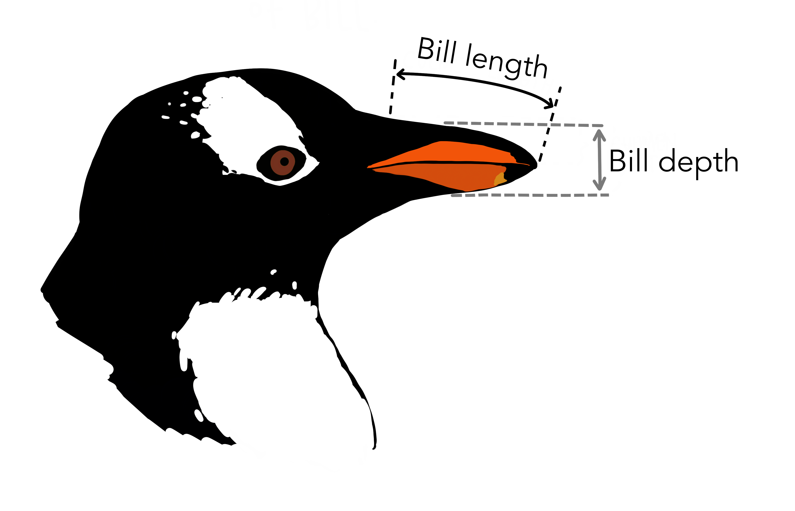

# SOVS Data Visualisation for Early Career Researchers
Seminar, September 1, 2022
 
 
Nancy Briggs
 
[Stats Central](https://www.analytical.unsw.edu.au/facilities/stats-central)

 
## June 29, 2022: Audience Participation!

For the seminar (Sept 1), I'd like a bit of input from you!

Please download this dataset: [penguins.csv](https://nancybriggs.github.io/SOVS_DataViz/penguins.csv)

This dataset contains data from physiological measures of penguins from three islands in the Palmer Archipelago, Antarctica. Variables included are:

- species (3 levels)
- island (3 levels)
- bill_length_mm (length of bill in mm)
- bill_depth_mm (depth of bill in mm)
- flipper_length_mm (length of flipper in mm)
- body_mass_g (mass in grams)
- sex (2 levels)
- year (3 levels)

Now here's where I need your participation! I'd like for you to think of a research question based on the available variables in the dataset, and make a plot that will help you to answer the question.  You don't have to do any analysis on the data, just the plot.

Then!  Save the plot, and email it to me at **nancy.briggs@unsw.edu.au** by **_August 12_**.  Tell me what your research question was, what the plot tells you about that question, and whether you think the plot was successful, given your goals.

I'll use some of the submitted plots in the talk (anonymously)!

**So, to summarise:**

1. Download the [data]{https://nancybriggs.github.io/SOVS_DataViz/penguins.csv}
2. Come up with a research question
3. Make a plot
4. Send the plot to me (nancy.briggs@unsw.edu.au) by Friday, August 12. Let me know what the question was, and whether you feel the plot helped you answer the question.

Gorman KB, Williams TD, Fraser WR (2014). Ecological sexual dimorphism and environmental variability within a community of Antarctic penguins (genus Pygoscelis). PLoS ONE 9(3):e90081. https://doi.org/10.1371/journal.pone.0090081

Horst AM, Hill AP, Gorman KB (2020). palmerpenguins: Palmer Archipelago (Antarctica) penguin data. R package version 0.1.0. 
https://allisonhorst.github.io/palmerpenguins/

Artwork by @allison_horst

